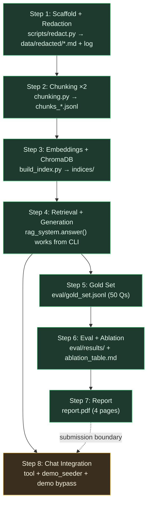

# Insurance Policy RAG — Implementation Plan

**Date:** 2026-05-20
**Author:** software-architect session (Dudu + Claude)
**Companion docs:** [`design-spec.md`](design-spec.md) (the *what*), [`DESIGN_RATIONALE.md`](DESIGN_RATIONALE.md) (the *why*)

> This is the **execution roadmap**. The design spec is the High-Level Design (HLD);
> this document turns it into ordered, testable build steps with a fully-specified
> blueprint for **Step 1 (Scaffold + redaction)** and lighter blueprints for Steps 2–8.

---

## 0. Framing

This is **not** an enterprise multi-service system — it's a single, focused Python
package (`src/`) consumed by a CLI, an eval harness, and (later) the `ai-wealth-monitor`
chat. So the architect workflow is adapted:

- **No microservices / API gateway / message queue / circuit breakers.** Those patterns
  don't apply.
- **Build steps run sequentially**, not in parallel — each step's output is the next
  step's input (redacted MD → chunks → embeddings → index → answer).
- **The contract that matters** is the in-process Python interface (`answer()`, `redact()`,
  the `Chunk` shape), already defined in the design spec §5.

### Decisions resolved before Step 1 (from discovery)

| Question | Decision |
|---|---|
| Source of known-PII strings | `data/known_pii.json` — **gitignored**, loaded if present |
| Raw PDFs available now? | **No** — tests run on synthetic fixtures, not real PDFs |
| Python environment | Fresh **`.venv`** inside the repo (already in `.gitignore`) |

---

## 1. Phased Execution Plan

The 8 build-order steps from the spec, as a dependency graph. Steps 1–7 are the
submission; Step 8 is Phase-2 integration into `ai-wealth-monitor`.



**Critical path:** S1 → S2 → S3 → S4 is the spine. S5 (gold set) can be drafted in
parallel with S2–S4 (it only needs the redacted MD from S1 to anchor citations), but
S6 (eval) needs both S4 (`answer()`) and S5 (gold set). S8 needs only S4.

| Step | Output | Primary test | Depends on |
|---|---|---|---|
| 1 | `data/redacted/*.md`, `data/redaction_log.json` | `test_redaction.py` | — |
| 2 | `data/processed/chunks_*.jsonl` | `test_chunking.py` | S1 |
| 3 | `indices/chroma_*/` | `test_embeddings.py`, `test_vector_store.py` | S2 |
| 4 | working `answer()` | `test_retrieval.py`, `test_e2e.py` | S3 |
| 5 | `eval/gold_set.jsonl` | manual review | S1 (anchors) |
| 6 | `eval/results/`, ablation table | `run_eval.py` | S4 + S5 |
| 7 | `report.pdf` | manual | S6 |
| 8 | chat tool + seeder + bypass | manual demo | S4 |

---

## 2. Step 1 Blueprint — Scaffold + Redaction

This is the immediate, fully-specified work. It produces the package skeleton plus a
working, tested redaction pipeline.

### 2.1 File structure created in Step 1

```
insurance-rag/
├── pyproject.toml                 # editable install, package metadata
├── requirements.txt               # pinned deps
├── data/
│   ├── raw/                        # (gitignored) user drops PDFs here later
│   ├── redacted/                   # (committed) output *.md
│   ├── processed/                  # (created, empty until Step 2)
│   ├── known_pii.json             # (gitignored) names/IDs — user-supplied
│   ├── known_pii.example.json     # (committed) template showing the shape
│   ├── redaction_log.json         # (committed) counts + safe context, no PII
│   └── MANIFEST.md                 # corpus metadata (spec §16)
├── src/
│   ├── __init__.py
│   ├── config.py                  # paths, model names, constants
│   ├── utils.py                   # file IO, logging setup
│   ├── pdf_to_md.py               # Docling wrapper: convert(pdf) -> str
│   └── redaction.py               # redact(md, known) -> (str, log_dict)
├── scripts/
│   └── redact.py                  # CLI: data/raw/*.pdf → data/redacted/*.md
└── tests/
    ├── __init__.py
    ├── conftest.py                # synthetic MD fixtures (no real PII)
    └── test_redaction.py          # the testable core of Step 1
```

> `chunking.py`, `embeddings.py`, `vector_store.py`, `retrieval.py`, `generation.py`,
> `rag_system.py`, `build_index.py`, `eval/` are **created in later steps** — not Step 1.

### 2.2 Module contracts (Step 1 only)

#### `src/config.py`
Centralizes all paths and constants. No logic.

```python
from pathlib import Path

ROOT          = Path(__file__).resolve().parent.parent
DATA_DIR      = ROOT / "data"
RAW_DIR       = DATA_DIR / "raw"
REDACTED_DIR  = DATA_DIR / "redacted"
PROCESSED_DIR = DATA_DIR / "processed"
INDICES_DIR   = ROOT / "indices"

KNOWN_PII_FILE = DATA_DIR / "known_pii.json"
REDACTION_LOG  = DATA_DIR / "redaction_log.json"

# Models (used from Step 3 onward; declared here as single source of truth)
EMBEDDING_MODEL  = "intfloat/multilingual-e5-large"
GENERATION_MODEL = "gemini-2.5-flash"

# Chunking (used from Step 2)
FIXED_CHUNK_SIZE    = 500
FIXED_CHUNK_OVERLAP = 50
SECTION_MAX_TOKENS  = 700

# Multi-tenancy
DEFAULT_FAMILY_ID = "demo_family_001"

# Retrieval (used from Step 4)
DEFAULT_TOP_K = 5
```

#### `src/utils.py`
Thin helpers; no domain logic.

```python
def get_logger(name: str) -> logging.Logger          # JSON-ish console logger, level from env
def read_text(path: Path) -> str
def write_text(path: Path, content: str) -> None      # creates parent dirs
def read_json(path: Path) -> dict | list
def write_json(path: Path, obj) -> None               # ensure_ascii=False (Hebrew), indent=2
```

#### `src/pdf_to_md.py`
Docling wrapper. Single public function.

```python
def convert(pdf_path: Path) -> str:
    """Convert a PDF to Markdown via Docling. Returns markdown with ## headings.
    Raises DoclingConversionError on failure (caught by the CLI, which skips the file)."""
```

> Not unit-tested in Step 1 (Docling is heavy, ML-based, one-time). Verified manually
> when the user adds real PDFs. The CLI handles its failure (exit code 2 per file).

#### `src/redaction.py` — the core deliverable

```python
PLACEHOLDERS = {
    "israeli_id":   "[ת\"ז]",
    "phone":        "[טלפון]",
    "email":        "[אימייל]",
    "license_plate":"[רישוי]",
    "iban":         "[IBAN]",
    "known_string": "[שם]",
}

def redact(md_text: str, known_strings: list[str] | None = None) -> tuple[str, dict]:
    """
    Remove PII from markdown text.

    Two passes:
      1. Regex pass — Israeli ID, phone, email, license plate, IBAN.
      2. Known-strings pass — exact substring match of caller-supplied names/IDs.

    Returns:
      (redacted_text, log_dict)

    log_dict shape (NEVER contains a raw PII value):
      {
        "redactions": [
          {"type": "israeli_id", "count": 3, "samples": ["...של [ת\"ז] לפי..."]},
          {"type": "known_string", "count": 5, "samples": ["...מר [שם] מבוטח..."]}
        ],
        "total": 8
      }
    "samples" windows are sliced from the ALREADY-REDACTED text (≤25 chars each side),
    so no raw PII can leak into the log even from adjacent matches.
    """
```

**Regex patterns (from spec §6):**

| Type | Pattern | Notes |
|---|---|---|
| `israeli_id` | `\b\d{9}\b` | 9 consecutive digits |
| `phone` | `\b0(5\d\|[2-4]\|7\d\|8\|9)-?\d{7}\b` | IL mobile + landline |
| `email` | `\b[\w.+-]+@[\w-]+\.[\w.-]+\b` | standard |
| `license_plate` | `\b\d{2,3}-\d{3}-\d{2,3}\b` | IL plate formats |
| `iban` | `\bIL\d{2}(?:\s?\d{4}){5}\b` | IL IBAN |

**Pass order:** regex first, then known-strings. (A known 9-digit ID caught by the ID
regex is already redacted — the known-strings pass simply finds nothing more; still safe.)

**Determinism:** pure function of `(md_text, known_strings)`. No randomness, no I/O.

#### `scripts/redact.py` — CLI orchestrator

```
Usage: python scripts/redact.py [--reset]

Flow:
  1. Load known_strings from data/known_pii.json if it exists (else []).
     - known_pii.json shape: {"strings": ["שם פרטי", "שם משפחה", "123456789", ...]}
  2. For each *.pdf in data/raw/:
       md           = pdf_to_md.convert(pdf)        # on failure: log, exit-code-2 marker, continue
       redacted, lg = redaction.redact(md, known_strings)
       write data/redacted/{stem}.md
       accumulate lg under {stem}
  3. write data/redaction_log.json  (per-file logs + grand total)
  4. print summary table + LOUD reminder:
       "⚠ Review data/redaction_log.json before committing or submitting."
```

### 2.3 TDD order for Step 1

Tests target `redaction.redact()` — the only pure, logic-bearing unit in this step.
Fixtures in `conftest.py` are **synthetic** (fake IDs/phones/names invented for the test),
never real PII.

| # | Test | Asserts |
|---|---|---|
| 1 | `test_redacts_israeli_id` | `123456789` → `[ת"ז]`, count 1 |
| 2 | `test_redacts_phone` | `050-1234567` and `02-1234567` both caught |
| 3 | `test_redacts_email` | `a.b@example.com` → `[אימייל]` |
| 4 | `test_redacts_license_plate` | `12-345-67` → `[רישוי]` |
| 5 | `test_redacts_iban` | `IL12 3456 7890 1234 5678 90` → `[IBAN]` |
| 6 | `test_redacts_known_string` | supplied name → `[שם]` |
| 7 | `test_log_has_no_raw_pii` | the raw fixture ID/phone/name strings appear **nowhere** in `json.dumps(log)` |
| 8 | `test_log_counts_correct` | counts per type match the fixture |
| 9 | `test_deterministic` | `redact(x) == redact(x)` byte-for-byte |
| 10 | `test_multiple_pii_one_doc` | mixed doc → all types redacted, total correct |
| 11 | `test_no_known_strings_arg` | `redact(md)` (None) works, regex-only |

Each follows the red→green→commit micro-cycle (write failing test → run, see it fail →
implement minimal code → run, see it pass → commit).

### 2.4 Step 1 acceptance criteria

- [ ] `.venv` created; `pip install -e .` succeeds (editable package importable as `src`)
- [ ] `pytest tests/test_redaction.py -v` → **all 11 pass**
- [ ] `data/known_pii.example.json` committed; `data/known_pii.json` gitignored
- [ ] `data/MANIFEST.md` exists with spec §16 fields (corpus values filled once PDFs added)
- [ ] No real PII anywhere in committed files (fixtures are synthetic)
- [ ] CLI `python scripts/redact.py` runs end-to-end on a sample PDF once the user adds one,
      producing `data/redacted/*.md` + `data/redaction_log.json`
- [ ] Log review reminder prints loudly; log verified to contain **zero** raw PII values

### 2.5 Constraints

- Do **not** implement chunking/embeddings/retrieval/generation — those are Steps 2–4.
- `redact()` stays a **pure function** (no file I/O inside it) — the CLI does I/O.
- Hebrew output: all JSON written with `ensure_ascii=False`.
- Never log, print, or commit a raw PII value.
- Follow the existing repo conventions (English code/comments per project rules).

---

## 3. Steps 2–8 — Roadmap Blueprints

Lighter specs; each gets its own detailed blueprint when we reach it. Contracts are
already pinned in design-spec §5.

### Step 2 — Chunking (×2 strategies)
- **Files:** `src/chunking.py`, `tests/test_chunking.py`; add `count_tokens()` to `utils.py`.
- **Contract:** `FixedSizeChunker(size, overlap).split(doc) -> list[Chunk]`,
  `SectionAwareChunker(max_size).split(doc) -> list[Chunk]`. `Chunk` shape per spec §5.
- **Token counting:** e5 tokenizer (`AutoTokenizer.from_pretrained(EMBEDDING_MODEL)`), not tiktoken.
- **Tests:** word-boundary splits, overlap correctness, `##` heading detection, recursive
  sub-split of >700-token sections, empty/heading-only merge, determinism.
- **Output:** `data/processed/chunks_fixed_size.jsonl`, `chunks_section_aware.jsonl`.

### Step 3 — Embeddings + ChromaDB
- **Files:** `src/embeddings.py`, `src/vector_store.py`, `build_index.py`,
  `tests/test_embeddings.py`, `tests/test_vector_store.py`.
- **Contracts:** `Embedder().encode(texts, is_query=False) -> np.ndarray` (applies
  `passage:`/`query:` prefix — spec §7); `VectorStore(strategy).add/query/reset`.
- **Reproducibility:** `torch.manual_seed(42)`, inference mode; `PersistentClient` fixed path;
  `build_index.py --reset` rebuilds from `data/processed/*.jsonl` identically.
- **Tests:** embedding shape 1024 + L2-normalized; add/query/reset; `where` filter;
  persistent reload.

### Step 4 — Retrieval + Generation (`answer()`)
- **Files:** `src/retrieval.py`, `src/generation.py`, `src/rag_system.py`, `tests/test_retrieval.py`, `tests/test_e2e.py`.
- **Contracts:** `retrieve(query, k, strategy, family_id) -> list[dict]` (**family_id
  mandatory — raises if missing**); `answer(question, family_id="demo_family_001",
  strategy="section_aware") -> dict` with the spec §5 return contract.
- **Generation:** Gemini 2.5 Flash, temp 0.2, the spec §6 Hebrew prompt; parse
  `[chunk_id: ...]` → `sources`; 429 backoff 1s/2s/4s.
- **Tests:** family_id isolation (no family-B chunk leaks to family-A query), k respected,
  scores descending, empty-query ValueError, e2e build→answer.

### Step 5 — Gold Set (50 Qs)
- **Files:** `eval/generate_gold_candidates.py`, `eval/gold_set.jsonl`.
- **Approach:** Claude generates ~75 candidates (different LLM than Gemini answerer →
  no circular eval); user curates to 50 (10 each: factual/numerical/temporal/negation/comparison).
- **Anchor-based citations** (spec §9): `must_cite = {source, pages, section_anchor}` —
  survives both chunking strategies.

### Step 6 — Eval + Ablation
- **Files:** `eval/run_eval.py`, `eval/results/*.json`, `eval/results/ablation_table.md`.
- **Metrics:** Hit@5, MRR; manual review of ≥10 (Correct/Partial/Incorrect/Hallucinated).
- **Ablation (4 rows):** fixed_size 500 vs section_aware (headline); fixed_size 300 vs 700
  (chunk-size effect). Optional 5th: dense vs hybrid.

### Step 7 — Report (4 pages)
- **Files:** `report.md` → `report.pdf`.
- Corpus description, pipeline, chunking comparison, eval results + ablation analysis,
  limitations & "what I'd improve next" (reranking, hybrid).

### Step 8 — Chat Integration (Phase 2, post-submission)
- **Files (in `ai-wealth-monitor`):** edit `backend/routers/dashboard_chat.py`, `demo_seeder`.
- Register `query_insurance_policies(question)` Gemini tool; keep `read_full_policy`.
- Demo-bypass change: skip mock **only for insurance** questions (spec §11).
- `pip install -e ../insurance-rag` so backend can import it.

---

## 4. How we'll execute

Each step is a red→green→commit cycle with its own tests, committed and pushed to
`github.com/dudumrk2/insurance-rag` before moving on. Step 1 is the immediate target;
the rest follow the dependency graph in §1.
